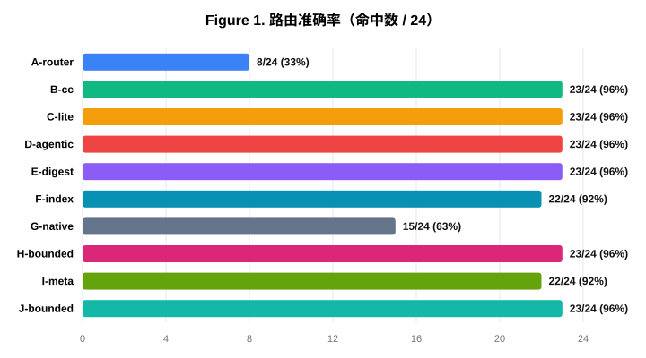
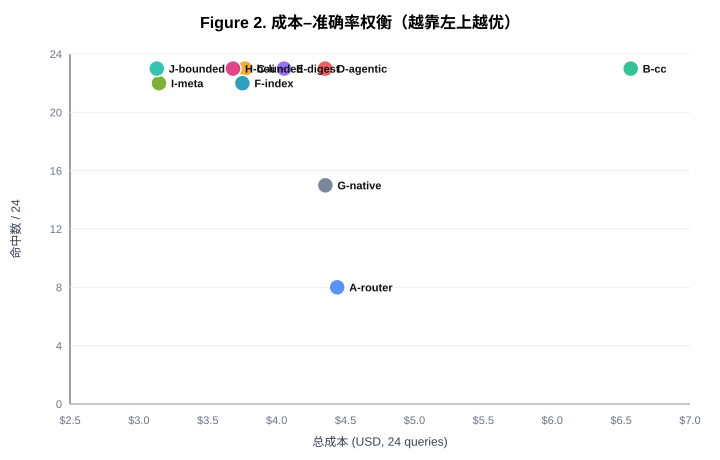
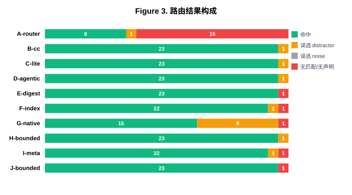
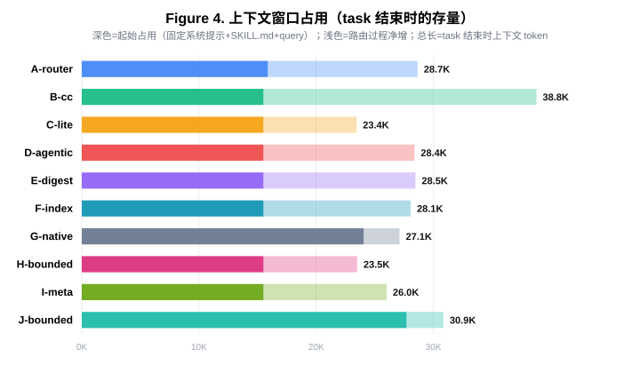

# Disabled-Skill 路由策略对比实验报告

**基于 SkillRouter 基准的九种路由实现评测**

实验日期:2026-05-22 ~ 2026-05-23 · 语料:SkillRouter eval-core(arXiv:2603.22455)裁剪匿名化版 · 规模:9 变体 × 24 查询 = 216 runs

---

## 摘要

当一个编码 agent(Claude Code)收到的请求无法被任何已启用的 Agent Skill 覆盖时,它需要从一批**已禁用**的 skill 中"路由"出最合适的一个并加载其指令。本实验系统对比了 **9 种 disabled-skill 路由实现**,涵盖三类范式:自实现检索器、直接语料交互(DCI,arXiv:2605.05242)、结构化 agentic 检索(AgenticRAG,arXiv:2605.05538),外加宿主原生 skill 选择作为对照。

在 SkillRouter 专家标注的 24 个真实任务查询、150 个 skill 的匿名化语料上,我们得到三个核心结论:

1. **自实现 lexical 检索器(A)在真实长查询上崩溃** —— 8/24,其中 12 次直接放弃(no-confident-match)。固定的词频评分接口无法咬合数百字的真实任务描述。
2. **读取 skill body 的 agent 检索方案(B/C/D/H)稳定达到 23/24**,且唯一失败项为一个数据标注争议案例;排除该项后为 23/23。
3. **仅读 metadata 的方案(E/F/I)达到 22-23/24,成本显著更低**;`I-meta` 以 22/24 命中 + 全场最低成本 \$3.15 成为成本-准确率帕累托最优点之一。宿主原生选择(G)仅 15/24,其中 8 次被功能近义的 distractor 带偏,复现了 SkillRouter 论文"metadata 不足以支撑大规模路由"的核心论断。

本报告同时记录了一轮由 Codex(GPT-5.5,xhigh)执行的方法学审查,以及据此修复的 6 类实验有效性缺陷 —— 本轮结果是修复后的权威数据。

---

## 1. 引言与研究问题

### 1.1 背景

Claude Code 与 Codex 等编码 agent 通过 **Agent Skill** 机制在推理时注入领域知识。但宿主对 skill 元数据有上下文预算约束(Claude Code 默认约 1% 上下文,Codex 约 2% / 8000 字符),skill 数量增长后,要么挤占上下文,要么被截断。

`skill-router` 项目提出的方案是:把不常用的 skill **禁用**(将 `SKILL.md` 重命名为 `SKILL.md.skill-router-disabled`),使其退出宿主的常驻元数据预算;当某个请求确实需要某项被禁用的能力时,再通过一个"路由"步骤把它找回来。

这个"路由"步骤如何实现,直接决定了系统的准确率与成本。本实验即对该步骤的多种实现做受控对比。

### 1.2 研究问题

> **RQ1(准确率)**:在一个存在大量功能近义干扰项的 skill 语料中,哪种路由实现能最可靠地选出正确 skill?
>
> **RQ2(成本)**:各实现的上下文 token 消耗、工具调用轮次、墙钟耗时、美元成本如何?准确率与成本如何权衡?
>
> **RQ3(机理)**:"读取 skill 正文"相对"仅读元数据描述"是否带来准确率优势?宿主原生的 skill 选择机制相对显式路由处于什么位置?

---

## 2. 相关工作

本实验的变体设计直接对标两篇 2026 年的检索范式论文:

- **arXiv:2605.05242 — Direct Corpus Interaction(DCI)**。主张 agent 用通用终端工具(`grep`/`find`/`sed`/shell 管道)直接搜索原始语料,不经 embedding、索引或 top-k 中介。论文给出两个实现:DCI-Agent-CC(Claude Code 全工具)与 DCI-Agent-Lite(最小 harness,仅 bash + read)。
- **arXiv:2605.05538 — AgenticRAG**。主张用结构化的 4 工具 harness(`search`/`find`/`open`/`summarize`)驱动一个有界 agentic 循环。

评测语料来自 **arXiv:2603.22455 — SkillRouter**。该基准把上游 skill 路由独立为研究对象,提供 87 个 SkillsBench 专家标注任务、约 80,000 个 skill 的检索池,以及针对每个 ground-truth skill 用 GPT-4o-mini 按"同域不同问题 / 同技术不同用途 / 过度泛化"三策略生成的 distractor(功能近义但错误)。其核心结论是:**完整 skill 正文是大规模、高度重叠 skill 池中的决定性路由信号,仅靠元数据不足**。本实验在受控规模上检验该结论是否成立。

---

## 3. 实验方法

### 3.1 语料构建

直接使用 SkillRouter `eval-core` 数据集,经 `crop-skillrouter.mjs` 裁剪为 **150 个 skill** 的受控语料:

| 成分 | 数量 | 来源 |
| --- | --- | --- |
| Ground-truth skill | 19 | 24 个 single-skill 任务的 `gt/*` 实体(部分任务共享同一 gt) |
| 针对性 distractor | 80 | 各 gt skill 对应的 `distractor/dist_<gt>_*`(SkillRouter 用 GPT-4o-mini 生成的功能近义干扰) |
| 噪声 skill | 51 | 从 78K easy 池确定性随机抽取,填充至 150 |

**裁剪的必要性与代价**:SkillRouter 原始池约 80K skill,其元数据目录约 440 万 token,远超模型上下文窗口 —— 这会让 E/F/I 等"把目录读进上下文"的变体直接无法运行。裁剪到 150 使所有变体可比,但代价是移除了大规模检索压力(见 §8 局限性)。

**答案泄露修复(关键)**:首版裁剪保留了 `gt-mesh-analysis` / `distractor-dist-*` 这样的目录名,前缀直接暴露了"谁是正确答案"。修复后,**所有 skill 的目录名与 frontmatter `name` 字段统一改为中性、不可推断类别的 `skill-001` … `skill-150`**,且编号在一次确定性洗牌后分配,使序号不泄露任何归属信息。只有 `description` 与 skill 正文(真正的路由信号)被原样保留。`skill-NNN → 原始归属` 的映射写入 `corpus-manifest.json`,仅用于离线分析,实验过程与 agent 均不可见。

### 3.2 查询集

24 个查询为 SkillRouter 的 single-skill 任务,查询文本即 SkillsBench 任务的 `instruction_text`。这些任务由领域专家撰写、与 skill 描述独立成文(SkillRouter 明确做了泄露防护:任务指令不得提及应使用哪个 skill),因此**不存在"为使答案可辩护而贴着 skill 描述写查询"的锚定偏置** —— 这正是本实验改用第三方数据集的主要动因。

查询为真实任务描述,长度数百字,含具体文件路径、输入输出格式、精度要求。其中 23 个查询的 gt skill 拥有针对性 distractor。

### 3.3 九个路由变体

| 变体 | 范式 | 路由方式 |
| --- | --- | --- |
| **A-router** | 自实现检索器 | 调用 `skill-router skills route` CLI,`auto` 模式(metadata → dci → lexical 三级级联评分) |
| **B-cc** | DCI-Agent-CC | agent 在禁用 skill 目录上自由使用 shell(`ls`/`grep`/`cat`) |
| **C-lite** | DCI-Agent-Lite | 仅 bash,使用有界 `grep｜xargs grep` 复合管道 + `sed -n` 局部读取 |
| **D-agentic** | AgenticRAG | 结构化 4 工具循环(`dci search/find/open/read` CLI 子命令) |
| **E-digest** | 优化 DCI | 2 次调用的 bash 封装:`skill-corpus catalog` → `skill-corpus show <id>` |
| **F-index** | 缩小 scope | 整个 skill 目录索引预先 baked 进 SKILL.md,1 次调用完成检索 |
| **G-native** | 无 router(对照) | 不加载 router,150 个 skill 全部启用,由 Claude Code 原生 skill 自动选择 |
| **H-bounded** | 受控 DCI-CC | 同 B,但限定 scoped glob、禁止裸 `ls`、强制有界输出 |
| **I-meta** | 仅元数据 | 只读 description 目录、显式推理选择,从不读取 skill 正文 |

九个变体构成三个"家族 × 消融"结构:B/C/H 是 agent shell 检索家族(约束程度递增),E/F/I 是元数据目录家族(目录递送方式 + 是否读 body),A/D/G 各为独立范式。

### 3.4 执行 harness

`run.mjs` 对每个 `(变体, 查询)` 单元执行:① 创建隔离的临时 `$HOME`;② 安装 `skill-router` 插件;③ 安装 150-skill 语料并全部禁用;④ 将该变体的 `SKILL.md` 工作流补丁进插件槽位(G-native 例外:改为全部启用、不加载插件);⑤ 启动子进程:

```
claude -p "<查询>" --output-format=stream-json --verbose
  --permission-mode=bypassPermissions --max-turns=25
  --append-system-prompt "<强制首个工具调用为 skill-router-skills>"
  --plugin-dir <插件路径>
```

agent 读取补丁后的 `SKILL.md`,按其工作流路由,最终输出一行 JSON `{"matched_skill_path":..., "matched_skill_name":...}`。harness 落盘完整 stream-json transcript 至 `runs/<变体>/<查询>.jsonl`。

### 3.5 评测指标

- **命中(hit)**:从最终 JSON 解析 `matched_skill_path`,抽取 `/skills/<dir>/SKILL.md` 的目录名,与查询 `expected` 严格相等。
- **失败去向**:借 `corpus-manifest.json` 把误选项归类为 `→distractor`(选了针对性干扰)、`→noise`(选了噪声 skill)、`→none`(无匹配 / 未声明选择)。
- **上下文窗口占用(存量)**:某一轮 assistant turn 实际接收的完整上下文 = `input_tokens + cache_creation_input_tokens + cache_read_input_tokens`。**起始 ctx** = 首轮(检索前)占用;**结束 ctx** = 末轮(task 结束)占用;**净增** = 结束 − 起始,即路由过程真正加进上下文的量。这是衡量"寻找 skill 消耗多少上下文"的主指标。
- **成本与流量**:从 stream-json `result.usage` 汇总 `total_cost_usd`、工具调用数、对话轮次、墙钟耗时。注意 `result.usage` 的 `cache_read` 是整个会话的**累积流量**(Σ每轮重读),会被轮次数放大,**不**反映上下文窗口占用 —— 本报告仅将其作为计费相关量,不作上下文指标。

---

## 4. 方法学审查与修正

本轮实验前,完整实验设计与 harness 代码经 **Codex(GPT-5.5,reasoning effort = xhigh)** 做了一轮对抗式方法学审查。审查发现 10 个问题,其中 3 个被判定为会使结论失效的严重缺陷。**本轮(SkillRouter)数据是修复全部影响结果的缺陷之后重跑的结果**,此前基于真实-GitHub-skill、合成语料的几轮数据均存在下列未修复缺陷,不应作为权威结论。

| 缺陷 | 严重度 | 后果 | 修复 |
| --- | --- | --- | --- |
| 目录名泄露答案(`gt-*` vs `distractor-*`) | 致命 | 任何能看到目录名的变体可不理解任务直接挑 `gt-*` | 目录名 + frontmatter name 全部匿名化为 `skill-NNN`,洗牌后编号 |
| 命中检测存在"假命中"回退 | 致命 | 「任何工具输出里出现 skill 路径即算命中」,把"读到候选文件"误判为"做出选择" | 删除该回退,仅认 agent 显式声明的 `matched_skill_path` |
| G-native 命名错配 | 高 | frontmatter `name` ≠ 目录 id,native 报名会被判错 | 目录名 = frontmatter name = `skill-NNN`,检测对齐 |
| 不清理旧 run | 高 | 报告可能混用陈旧 transcript | 开跑前清理目标 cell 的旧 jsonl |
| 失败 run 静默退出分母 | 高 | API 错误使 N 缩小,准确率虚高 | 失败写 error-marker jsonl,计入分母为 miss |
| proxy 凭据硬编码 | 低 | 凭据进入仓库文件 | 改为从环境变量读取 |

留作报告声明、不影响命中数字的问题(§8 详述):成本受 prompt-cache 与运行顺序影响、150 裁剪改变了任务规模、查询分布偏向少数宽泛 skill、n=1 无重复采样。

---

## 5. 结果

全部 216 个 run 均成功完成,无缺失、无 API 错误污染。

### 5.1 总体准确率



| 变体 | 命中 / 24 | 准确率 |
| --- | --- | --- |
| B-cc | 23 | 95.8% |
| C-lite | 23 | 95.8% |
| D-agentic | 23 | 95.8% |
| E-digest | 23 | 95.8% |
| H-bounded | 23 | 95.8% |
| F-index | 22 | 91.7% |
| I-meta | 22 | 91.7% |
| G-native | 15 | 62.5% |
| A-router | 8 | 33.3% |

准确率呈清晰的三档分层:读 body / 目录推理类方案聚集在 22-23/24;宿主原生选择(G)居中 15/24;自实现 lexical 检索器(A)垫底 8/24。

### 5.2 成本–准确率权衡



下表中:**起始 ctx / 结束 ctx** 为上下文窗口的实际 token 占用(存量,见 §3.5),按 24 个 query 取均值;**Σ** 列为 24 个 run 的合计,括号内为单轮均值。

| 变体 | 命中/24 | 起始 ctx | 结束 ctx | Σ 工具调用(单轮) | Σ 轮次 | cache_read Σ(计费) | Σ 成本(单轮) |
| --- | --- | --- | --- | --- | --- | --- | --- |
| A-router | 8 | 15.9K | 28.7K | 63 (2.6) | 111 | 1.34M | \$4.44 (\$0.185) |
| B-cc | 23 | 15.5K | 38.8K | 131 (5.5) | 179 | 3.27M | \$6.57 (\$0.274) |
| C-lite | 23 | 15.5K | 23.4K | 132 (5.5) | 180 | 2.55M | \$3.77 (\$0.157) |
| D-agentic | 23 | 15.5K | 28.4K | 112 (4.7) | 160 | 2.13M | \$4.35 (\$0.181) |
| E-digest | 23 | 15.5K | 28.5K | 73 (3.0) | 121 | 1.68M | \$4.05 (\$0.169) |
| F-index | 22 | 15.5K | 28.1K | 48 (2.0) | 96 | 1.22M | \$3.75 (\$0.156) |
| G-native | 15 | 24.0K | 27.1K | 24 (1.0) | 72 | 0.59M | \$4.35 (\$0.181) |
| H-bounded | 23 | 15.5K | 23.5K | 111 (4.6) | 159 | 2.30M | \$3.68 (\$0.153) |
| **I-meta** | **22** | **15.5K** | **26.0K** | **50 (2.1)** | **98** | **1.12M** | **\$3.15 (\$0.131)** |

帕累托前沿(无任何变体同时在准确率与成本上占优)由三点构成:**I-meta(22/24,\$3.15)**、**H-bounded(23/24,\$3.68)**、**C-lite(23/24,\$3.77)**。

值得注意:**B-cc 虽达 23/24,但 \$6.57 为全场最贵,被 C-lite 与 H-bounded 帕累托支配** —— 同样的准确率,自由 shell 探索的成本接近受控方案的两倍。A-router 与 G-native 既不在前沿,准确率也不占优。

> **指标口径提醒**:`cache_read` 是 24 个 run 的**累积计费量**(流量),被对话轮次数放大,**不等于**上下文窗口占用 —— 详见 §5.4。`成本`为 Claude Code 报告的 `total_cost_usd` 累加,算术准确,但受 prompt-cache 顺序噪声与 n=1 影响,宜作量级参考(§8)。

### 5.3 路由结果构成



失败去向揭示了各变体的失败**性质**差异:

- **A-router**:16 次失败中 15 次为 `→none` —— 12 次真正的 no-confident-match(放弃路由),3 次误选了另一个 gt skill;仅 1 次误选 distractor。即 A 的主要失败模式是**保守放弃**,而非被干扰带偏。
- **G-native**:9 次失败中 **8 次误选 distractor** —— 这是 G 的特征失败模式,被功能近义的干扰项系统性带偏。
- **B/C/D/H**:各仅 1 次失败,且均为同一个数据标注争议查询(§6.3)。
- **E/F/I**:E 仅 1 次 `→none`;F、I 各 2 次失败(1 次争议查询 + 1 次真正的 body-required 查询,§6.4)。

### 5.4 上下文窗口占用



本节回答 RQ2 的核心:**路由一个 skill,真正占用了多少上下文**。这里使用的指标是**上下文窗口占用(存量)**——某一轮 assistant turn 实际接收的完整上下文 `= input + cache_creation + cache_read`,而非把每轮重读累加起来的 `cache_read`(流量)。

**起始 ctx(检索前的固定基线)**:除 G-native 外所有变体均为约 **15.5K**(Claude Code 系统提示 + 工具定义 + `skill-router-skills` SKILL.md + 查询)。**G-native 起始即 24.0K** —— 150 个 skill 的描述常驻系统提示,尚未开始检索就比其他变体多吃 8.5K。这量化了"宿主原生加载不随语料规模 scale"的固定代价。

**结束 ctx(task 结束时的上下文占用)**:

| 变体 | 结束 ctx | 路由净增 | 备注 |
| --- | --- | --- | --- |
| B-cc | 38.8K | +23.3K | 自由 shell 读取多个 skill 全文,上下文膨胀最多 |
| A/D/E/F | 28.1–28.7K | +12.6–13.0K | 中档 |
| G-native | 27.1K | +3.1K | 净增小(几乎无工具检索),但起始基线已高 |
| I-meta | 26.0K | +10.5K | 仅读 description 目录 |
| C-lite / H-bounded | 23.4K / 23.5K | +7.9K / +8.0K | **有界化:结束占用全场最低** |

**关键修正 —— `cache_read` 不能代表上下文占用**。以 C-lite 为例:其 `cache_read` 累计 2.55M(全场第二高),但其**结束 ctx 仅 23.4K(全场最低)**,两个指标排名完全相反。原因是 `cache_read` 是"Σ每轮重读的上下文前缀",被对话轮次数主导(C-lite 跑了 180 轮);而每一轮重读的主体是 Claude Code 固定系统提示,与"检索了多少 skill 语料"无关。实测各变体 `cache_read ÷ 工具结果实际语料` 的比值在 6.5×–3759× 之间剧烈波动(G-native 因几乎无工具检索而高达 3759×),证明 `cache_read` 不是上下文占用的有效代理。**有界化的真实收益体现在结束 ctx:C-lite / H-bounded 把上下文占用压在 23.4–23.5K,相对 B-cc 的 38.8K 低约 40%**,且路由净增仅 7.9–8.0K(B-cc 为 23.3K)。

**工具调用**:F-index 仅 48 次(预置索引把检索压缩到约 1 次调用 / 查询),G-native 24 次(原生一步选择),I-meta 50 次;B/C/D/H 均在 110–132 次。

### 5.5 逐查询命中矩阵

`Y` = 命中,`·` = 未命中。列序:A B C D E F G H I。

| 查询 | gt skill | A | B | C | D | E | F | G | H | I |
| --- | --- | --- | --- | --- | --- | --- | --- | --- | --- | --- |
| 3d-scan-calc | mesh-analysis | Y | Y | Y | Y | Y | Y | · | Y | Y |
| azure-bgp-oscillation-route-leak | azure-bgp | Y | Y | Y | Y | Y | Y | Y | Y | Y |
| citation-check | citation-management | Y | Y | Y | Y | Y | Y | Y | Y | Y |
| court-form-filling | pdf | · | Y | Y | Y | Y | Y | Y | Y | Y |
| data-to-d3 | d3-visualization | · | Y | Y | Y | Y | Y | Y | Y | Y |
| dialogue-parser | dialogue_graph | · | Y | Y | Y | Y | Y | Y | Y | Y |
| earthquake-plate-calculation | geospatial-analysis | Y | Y | Y | Y | Y | Y | · | Y | Y |
| econ-detrending-correlation | timeseries-detrending | Y | Y | Y | Y | Y | Y | Y | Y | Y |
| enterprise-information-search | enterprise-artifact-search | · | Y | Y | Y | Y | Y | · | Y | Y |
| gh-repo-analytics | gh-cli | · | · | · | · | Y | · | · | · | · |
| jax-computing-basics | jax-skills | · | Y | Y | Y | Y | Y | Y | Y | Y |
| offer-letter-generator | docx | · | Y | Y | Y | Y | Y | Y | Y | Y |
| pddl-tpp-planning | pddl-skills | · | Y | Y | Y | Y | Y | Y | Y | Y |
| pptx-reference-formatting | pptx | Y | Y | Y | Y | Y | Y | Y | Y | Y |
| protein-expression-analysis | xlsx | · | Y | Y | Y | Y | Y | · | Y | Y |
| quantum-numerical-simulation | qutip | · | Y | Y | Y | Y | Y | Y | Y | Y |
| reserves-at-risk-calc | xlsx | · | Y | Y | Y | Y | Y | · | Y | Y |
| shock-analysis-demand | xlsx | · | Y | Y | Y | Y | Y | · | Y | Y |
| shock-analysis-supply | xlsx | · | Y | Y | Y | · | · | · | Y | · |
| taxonomy-tree-merge | hierarchical-taxonomy-clustering | · | Y | Y | Y | Y | Y | Y | Y | Y |
| video-tutorial-indexer | speech-to-text | · | Y | Y | Y | Y | Y | Y | Y | Y |
| virtualhome-agent-planning | pddl-skills | · | Y | Y | Y | Y | Y | Y | Y | Y |
| weighted-gdp-calc | xlsx | Y | Y | Y | Y | Y | Y | · | Y | Y |
| **命中合计** | | **8** | **23** | **23** | **23** | **23** | **22** | **15** | **23** | **22** |

---

## 6. 失败案例分析

### 6.1 A-router:lexical 检索器在真实长查询上的崩溃

A-router 调用 `skill-router skills route` 的 `auto` 模式(metadata → dci → lexical 三级级联评分)。在 16 个失败案例中,**12 个返回 `no-confident-match`** —— 路由器主动放弃。

以 `court-form-filling` 为例,查询是一段约 600 字的真实任务描述("填写位于 `/root/sc100-blank.pdf` 的加州小额法庭表格…")。`route --json` 的输出:

```
action: no-confident-match   routeMode: auto
  候选 user:skill-140  confidence=low  score=0.46
  候选 user:skill-043  confidence=low  score=0.42
  候选 user:skill-077  confidence=low  score=0.42
```

三个 top 候选的置信度全部为 `low`,分数集中在 0.42-0.46,无一越过选择阈值。**根因**:`auto` 模式的级联评分本质是词频/token 重叠打分,面对数百字、混入文件路径和格式说明的真实任务描述,信号被稀释,任何候选都拿不到高分。这与此前真实-GitHub-skill 轮次中 A 表现尚可(14-19/24)形成对照 —— 那些查询是人工撰写的、相对简短且贴近 skill 描述用词;SkillRouter 的真实任务描述则彻底暴露了 lexical 接口的脆弱性。

另有 3 次失败是误选 `gt/pptx`(`data-to-d3`、`dialogue-parser`、`video-tutorial-indexer`)—— A 的评分函数对 pptx 描述存在虚高偏好。A 的失败结构总结:**12 次保守放弃 + 3 次评分偏置误选 + 1 次被 distractor 带偏**。

### 6.2 G-native:宿主原生选择的粗粒度反射匹配

G-native 不加载 router,150 个 skill 全部启用,由 Claude Code 原生 skill 选择器在系统提示中一次性"反射式"挑选。9 个失败中 8 个误选了 distractor。

最具代表性的是 **4 个 Excel 任务(`protein-expression-analysis`、`reserves-at-risk-calc`、`shock-analysis-demand`、`weighted-gdp-calc`,gt 均为 `xlsx`)被 G 全部路由到同一个 docx distractor `dist_docx_465279d1`**。轨迹显示 G 仅用一次工具调用 `Skill[skill-026]` 直接选定,无任何审议:

```
TOOL[Skill]: {"skill": "skill-026"}      # skill-026 = distractor/dist_docx_465279d1
FINAL: {"matched_skill_path":null,"matched_skill_name":"skill-026"}
```

**根因**:原生选择器把 skill 元数据作为系统提示的被动背景,做的是"哪个工具看起来顺手"的快速匹配,而非逐候选审议。它对"office 文件操作"这一粗类别做了笼统匹配,无法区分 Excel 与 Word。这正中 SkillRouter distractor 的设计目标 —— distractor 就是"话题相关但解决不同问题"的近义项。G 的失败定量复现了 SkillRouter 论文的核心论断:**把语料压进系统提示、依赖宿主反射选择,在近义干扰下系统性失效**。

### 6.3 gh-repo-analytics:数据标注争议案例

`gh-repo-analytics` 是唯一让 8/9 变体失败的查询,需要单独审视其性质。查询要求"为 `cli/cli` 仓库准备一份 12 月社区活动小结,统计 PR、分析参与度"。涉及的两个 skill 描述:

- **gt(`gt/gh-cli`)**:"gh CLI 是 GitHub 官方命令行工具,用于与仓库、issue、PR 等交互。"—— 一段**泛化的工具说明**。
- **被 8 个变体选中的 distractor(`dist_gh-cli_e615b387`)**:"追踪并可视化多个 GitHub 仓库的贡献,分析团队表现与参与度,洞察一段时间内的 commits、PR、issue 解决情况。"

distractor 的描述在字面上**比 gt 更贴合查询意图** —— 查询要的正是"把原始活动变成参与度总结"。8/9 变体(含读 body 的 B/C/D/H)都选了 distractor,7 个甚至选了同一个。

**判定**:这不是路由方法的失败,而是 **SkillRouter 标注的 gt 与该任务的描述级最佳匹配存在客观分歧**。SkillRouter 的 gt 基于"该任务的官方解法实际调用了 gh-cli skill",但从纯路由信号看,distractor 的描述确实更匹配。**若将此争议查询从评测中剔除,B/C/D/H 的成绩为 23/23(100%),E 为 23/23**。报告在主表中保留该查询以维持数据完整性,但在解读时应意识到这一条目标准存疑。

### 6.4 shock-analysis-supply:真正的 body-required 案例

`shock-analysis-supply` 是本实验中最干净的"必须读正文才能路由对"的案例。查询是一个"供给冲击分析"任务,gt 为 `gt/xlsx`(实际需要 Excel 表格操作)。失败情况:

- **E-digest、F-index、I-meta**(均不读 / 少读 skill 正文)三者全部误选了 `gt/timeseries-detrending` —— 另一个 ground-truth skill,而非 distractor。
- **B-cc、C-lite、D-agentic、H-bounded**(均读取 skill 正文)全部命中 `gt/xlsx`。
- A-router 照例 no-match。

**根因**:查询的措辞("供给冲击""时间序列上的相关性")在**描述层面**强烈指向时间序列分析;只有读取 skill 正文才能看出该任务的实际操作是结构化表格计算,应路由到 xlsx。这是 SkillRouter 论文"full skill body 是决定性信号"在本受控规模上唯一一次清晰显现:**仅元数据的方案在此条上整体被一个语义近义的正确类 skill 带偏,读正文的方案则全部纠正**。

但需注意其**有限性**:在 24 个查询中,这种"元数据不足、正文才够"的情形仅出现 1 次。受控的 150-skill 规模下,元数据信号在绝大多数查询上仍然充分 —— 这与 SkillRouter 在 80K 规模上观测到的"去掉正文掉 31-44 个百分点"形成量级差异(见 §8)。

---

## 7. 讨论

### 7.1 读 body 与仅读 metadata 之争

| 维度 | 读 body(B/C/D/H) | 仅 metadata(E/F/I) |
| --- | --- | --- |
| 命中(剔除争议项后) | 23/23 | 22/23 |
| 唯一差距 | — | `shock-analysis-supply` 一条 |
| 代表成本 | \$3.68–6.57 | \$3.15–4.05 |
| 工具调用 | 110–132 | 48–73 |
| 结束 ctx(上下文占用) | 23.4–38.8K | 26.0–28.5K |

在受控 150-skill、描述质量良好的语料上,**读正文带来的准确率优势仅为 1 个查询(约 4 个百分点)**,而成本、轮次均显著高于仅元数据方案。上下文占用上两类各有低点(读 body 的 C/H 经有界化达 23.4–23.5K,仅元数据的 I-meta 为 26.0K),但读 body 中 B-cc 自由探索升至 38.8K。这意味着:**对于中小规模、描述撰写规范的 skill 语料,`I-meta`(仅元数据 + 显式推理)是性价比最优选择** —— 它以最低成本(\$3.15)拿到 22/24,仅在唯一一个真正 body-required 的查询上失分。

### 7.2 与 SkillRouter 论文结论的对照

SkillRouter 在 80K skill 规模上的核心结论是"仅元数据不足,移除正文导致 31-44 个百分点的准确率下降"。本实验在 150-skill 规模上,仅元数据方案相对读正文方案仅下降约 4 个百分点。

**这并不矛盾,而是规模效应的体现**:

- 语料越大、近义 skill 越密集,单靠 description 区分的难度越高,正文信号的边际价值越大。
- 本实验受窗口限制裁剪到 150,大幅削弱了大规模检索压力 —— 因此本实验**不能外推**至大规模场景的"仅元数据够用"。
- 但 G-native 的失败(8 次被 distractor 带偏)与 `shock-analysis-supply` 一条,仍在受控规模上**定性复现**了论文的方向性结论:近义干扰确实存在,纯反射式 / 纯描述式匹配确实会被它击穿。

### 7.3 范式层面的结论

- **自实现固定检索器(A)是明确的劣选**:lexical 评分接口无法处理真实长查询,大面积保守放弃。这印证了 DCI 论文的出发点 —— 固定的、压缩式的检索接口是 agentic 检索的瓶颈。
- **宿主原生选择(G)不可取**:既准确率低(15/24),又因全量 skill 描述进系统提示而成本不低(\$4.35)、input token 暴涨(242K),且不随语料规模 scale。
- **DCI 与目录推理方案整体可靠**:agent 自主检索(无论读不读 body)在受控规模上都达到 22-23/24。其内部差异主要在成本,而非准确率。
- **"有界化"是真实且廉价的优化**:H-bounded 相对 B-cc 在同等 23/24 准确率下,把成本从 \$6.57 压到 \$3.68(-44%)、task 结束时上下文占用从 38.8K 压到 23.5K(-39%)、路由净增从 23.3K 压到 8.0K(-66%)。

---

## 8. 局限性

本节列出已知的、影响结论外推性但不影响本轮命中数字的因素,以供严谨解读。

1. **n = 1,无重复采样**。每个 `(变体, 查询)` 单元仅运行一次,未固定温度、未做多次重复。23/24 与 22/24 之间的差距处于采样噪声量级,不应视为变体优劣的确证。**置信区间需要每单元 5-10 次重复才能建立。**
2. **150-skill 裁剪改变了任务规模**。受上下文窗口限制,语料从 80K 裁剪至 150,移除了大规模检索压力,使"把目录读进上下文"的 E/F/I/G 变得可行。本实验的"仅元数据够用"结论**严格限定在受控规模内**,不可外推至数千至数万 skill 的真实大规模场景。
3. **成本数字受 prompt-cache 与运行顺序影响**。`total_cost_usd` 为 Claude Code 报告的真实计费值,经核对无重复计数(每个 run 恰好 1 个 result event),算术准确;但 216 个 run 顺序执行,Anthropic 侧 prompt-cache(5 分钟 TTL、跨请求生效)的命中状态随运行顺序与缓存预热程度波动,使 `cache_read / cache_creation` 构成、进而美元成本存在数个百分点的抖动。叠加 n=1,美元成本宜作**量级参考**(如 I-meta ≈\$3 与 B-cc ≈\$6.5 的两倍差距可信),而非把 \$3.15 与 \$3.68 当作精确排名。
4. **`cache_read` 不是上下文占用指标**。早期版本曾用 `cache_read` 累计量代表"上下文消耗",这是错误的 —— 它是 Σ每轮重读的流量,被对话轮次数放大,与"检索吞进多少 skill 语料"无因果关系(实测 `cache_read ÷ 工具结果语料` 比值在 6.5×–3759× 间波动)。本报告已改用上下文窗口占用(存量,§3.5)作为上下文指标;`cache_read` 仅保留为计费相关量。
5. **查询分布偏向少数宽泛 skill**。24 个查询中 5 个的 gt 为 `xlsx`、2 个为 `pddl-skills`,即 7/24 的结果由两个宽泛 skill 驱动。这是 SkillRouter 数据本身的分布特性,非人为引入,但意味着这两个 skill 的描述质量对总分有放大影响。
6. **`gh-repo-analytics` 的 gt 标注存疑**(§6.3)。该查询的 distractor 描述客观上比 gt 更贴查询,8/9 变体"失败"实为选了一个更匹配的 skill。剔除该条后读 body 方案为 23/23。
7. **"hit"衡量的是路由产物,辅以但未完全强制流程合规**。修复后命中判定仅认 agent 显式声明的 `matched_skill_path`,已排除"读到候选即算命中"的假命中;但尚未自动校验"A 确实用了 route CLI""I-meta 确实未读 body"等变体合规性 —— 这部分目前依赖 transcript 人工抽查。

---

## 9. 优化计划

基于本轮发现,后续工作按优先级排列:

### P0 — 提升统计置信度
- **多次重复采样**:对全部或至少边界查询(`shock-analysis-supply`、`gh-repo-analytics` 及各变体的单点失败)每单元重复 5-10 次,建立命中率的置信区间,确认 23/24 vs 22/24 是否为真实差异。
- **固定模型与温度**:在 `claude -p` 调用中显式 pin 模型版本与 `temperature=0`,消除采样漂移。

### P1 — 修复 A-router(自实现检索器)
A 是当前唯一明确失效的实现,且 `auto` 模式 12 次保守放弃。改进方向:
- 级联在 metadata/dci/lexical 全部低置信时,**不应直接放弃**,而应回退到一次 agent 自主的 body 检索(即把 B/H 的策略作为 A 的兜底层)。
- 评分函数应对长查询做关键词抽取 / 查询压缩预处理,而非直接对数百字原文做 token 重叠打分。
- 修正对 `pptx` 等 skill 的评分偏置(3 次误选集中于此)。

### P1 — 把 I-meta 升级为带 escalation 的混合路由
当前 I-meta 唯一失分在 `shock-analysis-supply`(元数据被语义近义项带偏)。混合方案:
- 默认走 I-meta 的低成本元数据推理。
- **仅当**元数据层出现 2 个以上高分近义候选、无法置信区分时,才对这少数候选 escalate 到 body 检索。
- 预期:以接近 I-meta 的成本(\$3.15 量级)拿到 B/C/H 的 23/24 准确率。这是本实验数据直接指向的最优工程方案,值得作为变体 J 实现并评测。

### P2 — 扩大规模验证外推性
- 在不超出上下文窗口的前提下,把语料从 150 逐步扩至 500 / 1000,观察"仅元数据"方案的准确率衰减曲线,定位它相对读 body 方案开始显著落后的规模拐点。
- 对 catalog 类变体(E/F/I)增设"先 grep 缩候选再读"的大规模适配版本,使其在语料超出上下文预算时仍可运行。

### P2 — 增强流程合规校验
- 在 `render-report.mjs` 中加入自动合规检查:A 必须出现 `skills route` 调用、D 必须用 `dci search/find/open`、C/H 必须仅用 Bash、I-meta 不得出现读 body 的命令。把不合规的 run 单独标注,避免"路由方式跑偏但碰巧命中"污染结论。

### P3 — 数据集清理
- 复核 `gh-repo-analytics` 等 gt 标注存疑的查询,必要时联系 SkillRouter 上游或在本地基准中标注为 "ambiguous" 并从主指标剔除。
- 平衡查询的 gt 分布,降低 `xlsx` 的权重集中度。

---

## 10. 结论

在 SkillRouter 专家标注的 24 个真实任务、150-skill 匿名化语料上对九种 disabled-skill 路由实现的受控对比表明:

1. **自实现 lexical 检索器(A-router)在真实长查询上崩溃(8/24)**,固定压缩式检索接口是 agentic 检索的瓶颈 —— 与 DCI 论文的出发点一致。
2. **agent 自主检索(DCI 与目录推理范式)整体可靠(22-23/24)**,内部差异主要在成本而非准确率。
3. **`I-meta`(仅元数据 + 显式推理)是受控规模下的性价比最优解** —— 22/24 命中、全场最低成本 \$3.15;`H-bounded` 与 `C-lite` 在帕累托前沿上提供"23/24 + 约 \$3.7"的更高准确率选项。
4. **宿主原生 skill 选择(G-native)不可取** —— 15/24,8 次被功能近义 distractor 带偏,且成本不低、不随语料规模 scale,在受控规模上即定性复现了 SkillRouter "纯元数据 / 反射式匹配不足"的论断。
5. 读 skill 正文相对仅读元数据,在本受控规模上仅带来约 4 个百分点的准确率优势(集中于唯一一个 body-required 查询),却伴随显著更高的成本与上下文消耗。**最优工程路线是"仅元数据为默认快路径 + 近义候选时按需 escalate 到 body 检索"的混合方案**(§9 P1)。

本实验经历真实-GitHub-skill、合成语料、SkillRouter 三个语料阶段;前两阶段分别受"查询锚定偏置"与"目录 id 泄露答案"缺陷影响,叠加 Codex 方法学审查发现的假命中等问题,均已在本轮修复。**本报告的 SkillRouter 轮次数据是修复后的权威结果。**

---

## 附录:实验产物清单

| 产物 | 路径 | 说明 |
| --- | --- | --- |
| 实验 harness | `experiments/dci-compare/run.mjs` | 创建隔离环境、安装语料、执行 216 runs |
| 语料裁剪脚本 | `experiments/dci-compare/crop-skillrouter.mjs` | SkillRouter eval-core → 150-skill 匿名化语料 |
| 图表生成脚本 | `experiments/dci-compare/gen-figures.mjs` | 从 runs 生成 4 张 SVG |
| HTML 报告生成 | `experiments/dci-compare/render-report.mjs` | 交互式 HTML 报告 |
| 9 个变体定义 | `experiments/dci-compare/variants/*.SKILL.md` | 各路由实现的工作流 |
| 匿名化语料 | `experiments/dci-compare/skillrouter-skills/` | 150 个 `skill-NNN` |
| 归属映射 | `experiments/dci-compare/corpus-manifest.json` | `skill-NNN → gt/distractor/noise`,仅离线分析用 |
| 查询集 | `experiments/dci-compare/queries.json` | 24 个 SkillRouter 任务 |
| 原始 transcript | `experiments/dci-compare/runs/<变体>/<查询>.jsonl` | 216 份 stream-json |
| 图表 | `experiments/dci-compare/figures/fig1-4.svg` | 准确率 / 帕累托 / 失败构成 / 资源 |
| 交互式报告 | `experiments/dci-compare/runs/report.html` | 含逐 run 执行轨迹 timeline |
